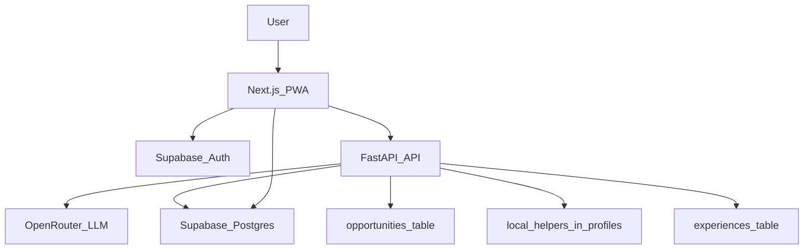

# TravelAI — Tech Stack

> Kullanılan teknolojiler, servis seçimlerinin gerekçeleri ve geliştirme sürecinde AI'ın nasıl kullanıldığı.

---

## 1. Genel Mimari



Monorepo yapısı; frontend ve backend bağımsız olarak deploy edilir:

```
TravelAI/
├── frontend/      → Next.js (Vercel'e deploy)
├── backend/       → FastAPI (Render'a deploy)
├── supabase/      → SQL migrations + RLS policies
└── docs/          → Tüm proje dokümantasyonu
```

---

## 2. Frontend

### Next.js 14 (App Router)
- **Neden:** React Server Components ile SSR/SSG desteği; App Router'ın nested layout yapısı, auth middleware ve route group'ları proje yapısına uyuyor.
- **PWA:** `next-pwa` ile service worker; son itinerary offline cache'lenir.
- **Mobile-First:** Tüm bileşenler önce mobil için tasarlanır, `lg:` breakpoint'ten itibaren desktop layout.

### TypeScript
- Tüm bileşenler ve utility fonksiyonlar strict TypeScript ile yazılır.
- API response tipleri `types/` altında merkezi olarak tanımlanır.

### Tailwind CSS
- Design system token'ları `tailwind.config.ts` ile extend edilmiş sky paleti, custom border-radius ve font ailelerini içerir.
- `styles/tokens.css` — CSS custom properties olarak tüm token'lar.

### Supabase JS Client (`@supabase/supabase-js`)
- Auth akışı (OTP gönder / doğrula / session yönetimi) doğrudan Supabase client üzerinden.
- `profiles`, `trips`, `experiences` tablolarına doğrudan okuma (RLS korumalı).
- Supabase Realtime: fırsat `status` güncellemeleri için (Faz 2).

### State Yönetimi
- Auth state: `AuthContext` (React Context + Supabase `onAuthStateChange`).
- Server state / API cache: `fetch` + React Server Components; Faz 2'de SWR/React Query.

### Ortam Değişkenleri (Frontend)
```
NEXT_PUBLIC_SUPABASE_URL
NEXT_PUBLIC_SUPABASE_ANON_KEY
NEXT_PUBLIC_API_BASE_URL
```

---

## 3. Backend

### FastAPI (Python 3.12)
- **Neden:** Async-first yapısı LLM çağrılarının uzun bekleme süresiyle uyumlu; Pydantic v2 entegrasyonu response doğrulamasını kolaylaştırıyor; OpenAPI/Swagger otomatik oluşturulur.
- `uvicorn` ile çalışır; Render'da deploy edilir.
- **Paket yönetimi:** `uv` (hızlı, lock-file tabanlı).

### Pydantic v2
- Tüm request/response modelleri Pydantic `BaseModel` ile tanımlanır.
- LLM çıktısı JSON → Pydantic validation; hatalı çıktıda "repair" stratejisi (ikinci LLM çağrısı).
- RORO (Receive an Object, Return an Object) pattern uygulanır.

### Proje Yapısı (Backend)
```
backend/
├── main.py           → FastAPI app, lifespan, middleware
├── dependencies.py   → Supabase JWT doğrulama dependency
├── core/
│   ├── config.py     → Pydantic Settings, env yönetimi
│   └── security.py   → JWT doğrulama (JWKS + PyJWT)
├── db/
│   └── supabase.py   → Supabase Python client singleton
├── routers/
│   ├── auth.py       → /auth/verify-edu
│   ├── trips.py      → /trips CRUD
│   ├── tickets.py    → /tickets + /opportunities
│   ├── users.py      → /profile, /profile/local-helper
│   ├── itinerary.py  → /itinerary/generate (LLM)
│   ├── experiences.py→ /experiences (Share Experience)
│   └── locals.py     → /locals (Local Help)
└── schemas/
    ├── auth.py
    ├── trips.py
    ├── itinerary.py
    ├── opportunities.py
    ├── experiences.py
    └── locals.py
```

### Ortam Değişkenleri (Backend)
```
SUPABASE_URL
SUPABASE_SERVICE_ROLE_KEY
SUPABASE_JWT_AUD          → genelde "authenticated"
SUPABASE_JWKS_URL         → {SUPABASE_URL}/auth/v1/.well-known/jwks.json
OPENROUTER_API_KEY
OPENROUTER_MODEL          → varsayılan: openai/gpt-4o-mini
```

---

## 4. Database & Auth — Supabase

### Supabase (PostgreSQL + Auth)
- **Neden:** Tek platform; hem managed Postgres hem de Auth (email OTP), realtime ve storage. iOS / web aynı backend sözleşmesini kullanır.
- RLS (Row Level Security) ile veri güvenliği; tüm tablolarda `auth.uid()` kontrolü.
- Migrations `supabase/migrations/` altında SQL dosyaları olarak versiyonlanır.

### Auth Yaklaşımı — JWT Doğrulama (Backend)

Web (Next.js) ve mobil Supabase Auth üzerinden login olur. API çağrılarında `Authorization: Bearer <access_token>` gönderilir.

**Backend Doğrulama Akışı:**
1. JWT header'daki `kid` ile Supabase'in JWKS endpoint'inden public key seçilir (`SUPABASE_JWKS_URL`)
2. İmza doğrulaması + `iss`, `aud`, `exp` kontrolü yapılır
3. Başarılıysa `sub` (user id) → `auth.uid()` eşleniği olarak kullanılır

Backend "login" yapmaz; yalnızca gelen token'ı doğrular.

```python
# dependencies.py — FastAPI dependency
async def get_current_user(token: str = Depends(oauth2_scheme)) -> dict:
    # JWKS'den public key al → JWT verify → sub döndür
    ...
```

**Edu Domain Kontrolü:**
- `POST /auth/verify-edu`: backend tarafında da domain guard
- Frontend'de de `allowed_email_suffixes` listesi ile ikinci katman kontrol

### Migrations
```
supabase/migrations/
├── 0001_profiles_trips_rls.sql    → profiles + trips + RLS
├── 0002_events_tickets.sql        → tickets tablosu
└── 0003_new_features.sql          → opportunities, experiences, experience_likes (pending)
```

---

## 5. AI Entegrasyonu — OpenRouter

### OpenRouter
- **Neden:** Model bağımsızlık; GPT-4o, Gemini Flash veya başka bir model arasında tek API anahtarıyla geçiş yapılabilir. Maliyet optimizasyonu için model değiştirebilirlik kritik.
- `POST /itinerary/generate` endpoint'inde çağrılır.

### LLM Prompt Stratejisi
1. Kullanıcı parametreleri + Company Opportunities verileri + Local Helper profilleri context'e eklenir
2. "Strict JSON schema" formatında yanıt istenir (function calling / tool use benzeri)
3. LLM yanıtı → Pydantic validation; geçersizse ikinci "repair" çağrısı yapılır
4. Yanıt `trips.itinerary_data JSONB` alanına kaydedilir

### Thinking Mode (UX ↔ Backend Uyumu)
- MVP: senkron `POST` (10–20s timeout yönetimi, frontend loading state)
- Faz 2: job queue (`POST /itinerary/generate` → job id → `GET /itinerary/jobs/{id}` polling)

---

## 6. Deploy

### Frontend — Vercel
- Branch: `main` → production
- Preview deployments: her PR için otomatik
- Env: Vercel Dashboard'dan `NEXT_PUBLIC_*` değişkenleri

### Backend — Render
- `uvicorn backend.main:app --host 0.0.0.0 --port $PORT`
- Public base URL: `https://api.<domain>`
- CORS: yalnızca production frontend origin + local dev origin'leri
- Health check: `GET /api/health`

### Pipeline Ayrımı
- Backend pipeline: yalnızca `backend/**` + `supabase/**` değişince tetiklenir
- Frontend pipeline: yalnızca `frontend/**` değişince tetiklenir
- Supabase migration'ları: staging → prod sıralamasıyla manuel uygulama

---

## 7. Geliştirme Sürecinde AI Kullanımı

| Alan | Kullanım |
|---|---|
| **Cursor IDE** | Kod üretimi, refactor, hata ayıklama — tüm geliştirme süreci Cursor üzerinde yürütülüyor |
| **Doküman oluşturma** | PRD, Plan, Design System ve diğer dokümanlar Cursor ile oluşturuldu/güncellendi |
| **Prompt engineering** | LLM itinerary prompt'ları test edilerek optimize edildi |
| **Schema tasarımı** | Veritabanı şeması ve Pydantic modelleri AI destekli tasarlandı |
| **Kod review** | Edge case ve güvenlik kontrolleri için AI destekli review |
